# Bidirectional Supervision for Neural Radiance Caching

## Setup: Bidirectional Supervision

We train a neural radiance cache (NGP) at 3D scene positions to accelerate rendering. Supervision comes from two sources:

- **Eye paths**: traced from the sensor into the scene (standard path tracing). These handle all transport *except* paths that pass through specular surfaces after leaving the light.
- **Light paths**: traced from the light source through one or more specular bounces, then connected at the first diffuse surface ($\text{light} \to \text{specular}^{+} \to \text{diffuse}$). These capture caustics -- transport that eye-only paths cannot efficiently sample.

The two path types are constructed to be **disjoint**: eye paths suppress $\text{diffuse} \to \text{specular}^{+} \to \text{light}$ transport, while light paths only contribute specular caustic transport. This means the final radiance is simply the sum of the two caches, with no double-counting.

Our goal is to learn **two disjoint caches** -- one for eye-path radiance and one for light-path radiance -- whose sum gives the full radiance at each surface point. Eye-path supervision is straightforward: each eye path directly provides a contribution at the positions it visits. The challenge is building a correct supervision signal for the light-path cache.

> **Visual explainer:** See [Visual 1 — Two disjoint path families](bdpt-presentation.html) for an interactive diagram showing light paths refracting through a glass sphere to form a caustic, and eye paths covering all other transport.

---

## The Problem: Supervising the Light Cache

The most direct expression for light-path radiance at a point $x$ is an expectation over *all* light paths $y \sim p(y)$ (we omit the outgoing direction for simplicity -- the cache is queried at a fixed direction toward the camera):

$$
L(x) = \mathbb{E}_{y \sim p(y)}\left[ \frac{f(y)}{p(y)} \cdot \delta(\mathrm{endpoint}(y) = x) \right]
$$

This is correct in expectation, but **extremely noisy**: most light paths miss any given point entirely, so the estimator is dominated by zeros with rare large spikes. It would require an impractical number of samples to converge.

> **Visual explainer:** See [Visual 2 — The naive estimator and its reformulation](bdpt-presentation.html) for a diagram showing most light paths missing the target point, and a slit geometry example demonstrating why the density correction is essential (uncorrected supervision overestimates at the tails and underestimates at the caustic peak).

---

## Reformulation via Area Density

Instead of considering all light paths, we can restrict our expectation to **only light paths that actually arrive at the point**. This is much less noisy since every sample contributes.

However, this changes the measure of the expectation. Let $y$ denote a light path, $x$ a surface point, and $f(y)$ the path throughput. Start by writing the radiance as an expectation over $p(y|x)$, the distribution of paths conditional on ending at $x$:

$$
L(x) = \mathbb{E}_{y \sim p(y|x)}\left[ \frac{f(y)}{p(y|x)} \cdot \delta(\mathrm{endpoint}(y) = x) \right]
$$

By Bayes' rule, $p(y|x) = p(y,x) / p_{l,\text{area}}(x)$. The joint factors as $p(y,x) = p(x|y) \cdot p(y)$, where $p(x|y) = \delta(\mathrm{endpoint}(y) = x)$ since a path's endpoint is deterministic. Substituting and cancelling the $\delta$ terms:

$$
\boxed{L(x) = \mathbb{E}_{y \sim p(y|x)}\left[ \frac{f(y)}{p(y)} \right] \cdot p_{l,\text{area}}(x)}
$$

Each path contributes its importance weight $f(y)/p(y)$, scaled by $p_{l,\text{area}}(x)$ -- the unknown area density of light paths ending at $x$, which we must learn.

> **Visual explainer:** See [Visual 3 — The density estimation trick](bdpt-presentation.html) for an interactive diagram showing how interleaved eye and light path streams at the surface encode the density ratio, with a density subplot contrasting the flat $p_{e,\text{area}}$ against the peaked $p_{l,\text{area}}$.

**Definitions:**
- $p_{l,\text{area}}(x)$: **area density of light paths** ending at point $x$ (unknown -- learned by the mask NGP)
- $p_{e,\text{area}}(x)$: **area density of eye paths** arriving at point $x$ (known analytically, since we control the eye resampling distribution)

---

## The Solution: Binary Classification for Density Estimation

We observe that light paths arriving at a point and eye paths arriving at a point form two interleaved streams:

- **Light path arrivals** at a point: label = **1**
- **Eye path arrivals** at a point: label = **0**

If we train a regressor to predict the mean label (the "light frequency") at each point, we can derive what this converges to. Consider a small patch $\Delta A$ around point $x$. In a batch of $N$ total path samples ($N_e$ eye paths, $N_l$ light paths):

- Expected number of **eye arrivals** in the patch: $N_e \cdot p_{e,\text{area}}(x) \cdot \Delta A$
- Expected number of **light arrivals** in the patch: $N_l \cdot p_{l,\text{area}}(x) \cdot \Delta A$

Each eye arrival contributes label 0; each light arrival contributes label 1. The expected mean label over all arrivals in the patch is:

$$
\mathbb{E}[\bar{y}] = \frac{N_l \cdot p_{l,\text{area}}(x) \cdot \Delta A}{N_e \cdot p_{e,\text{area}}(x) \cdot \Delta A + N_l \cdot p_{l,\text{area}}(x) \cdot \Delta A}
$$

The $\Delta A$ cancels, and if we set $N_e = N_l$ (equal number of eye and light samples per batch):

$$
\alpha(x) = \frac{p_{l,\text{area}}(x)}{p_{e,\text{area}}(x) + p_{l,\text{area}}(x)}
$$

Since $p_{e,\text{area}}(x)$ is known analytically (we control the eye resampling distribution), we can **recover** the unknown $p_{l,\text{area}}(x)$:

$$
p_{l,\text{area}}(x) = p_{e,\text{area}}(x) \cdot \frac{\alpha(x)}{1 - \alpha(x)}
$$

This is implemented as a **mask NGP** trained in Phase 1 using the following loss.

### Mask Loss

The mask NGP predicts $\alpha(x)$ and is trained with L2 regression against binary labels: eye-path positions get target 0, light-path positions get target 1:

$$
\mathcal{L}\_{\text{mask}} = \mathbb{E}\_{x \sim p\_e}\left[ \alpha(x)^2 \right] + \frac{N\_l}{N\_e} \cdot \mathbb{E}\_{x \sim p\_l}\left[ (\alpha(x) - 1)^2 \right]
$$

The $N_l / N_e$ factor ensures each sample has equal influence regardless of pool size.

Once $p_{l,\text{area}}$ is known, we freeze the mask and train color NGPs in Phase 2 with the correct density-weighted supervision.

> **Visual explainer:** See [Visual 4 — Two-phase training pipeline](bdpt-presentation.html) for a flowchart of the Phase 1 (mask) and Phase 2 (color) architecture, showing how the frozen mask feeds into the color training.

---

## Color Supervision

We maintain **two separate color NGPs** -- an eye color NGP and a light color NGP -- and train them with three loss terms.

### Eye Loss

The eye color NGP is supervised directly with eye-path contributions:

$$
\mathcal{L}_{\text{eye}} = \mathbb{E}_{x \sim p_e}\left[ \| \hat{c}_e(x) - c_e(x) \|^2 \right]
$$

where $c_e(x)$ is the eye-path contribution at $x$. This is standard L2 regression.

### Light Loss + Zero Supervision

The light color NGP has two loss terms that work together. At light-sampled positions, we supervise with a scaled target:

$$
\mathcal{L}_{\text{light}} = \mathbb{E}_{x \sim p_l}\left[ \left\| \hat{c}_l(x) - c_l(x) \cdot (p_{e,\text{area}}(x) + p_{l,\text{area}}(x)) \right\|^2 \right]
$$

At eye-resampled positions, we supervise with zero:

$$
\mathcal{L}_{\text{zero}} = \mathbb{E}_{x \sim p_e}\left[ \| \hat{c}_l(x) \|^2 \right]
$$

**Why this is correct.** Both loss terms act on the same light color network. A position $x$ is visited by light sampling with frequency proportional to $p_{l,\text{area}}(x)$, or by eye resampling with frequency proportional to $p_{e,\text{area}}(x)$. L2 regression converges to the frequency-weighted expected target:

$$
\mathbb{E}[\mathrm{target} \mid x] = \frac{p_{l,\text{area}}}{p_{l,\text{area}} + p_{e,\text{area}}} \cdot c_l(x) \cdot (p_{e,\text{area}} + p_{l,\text{area}}) + \frac{p_{e,\text{area}}}{p_{l,\text{area}} + p_{e,\text{area}}} \cdot 0 = p_{l,\text{area}}(x) \cdot c_l(x)
$$

So the light color NGP learns $p_{l,\text{area}} \cdot c_l$ -- exactly the quantity needed. The scale factor $(p_{e,\text{area}} + p_{l,\text{area}})$ is chosen precisely to cancel with the selection frequency, producing this clean result. Without it, the zero-supervision term would be insufficient to correct the bias.

> **Visual explainer:** See [Visual 5 — Why the light color supervision converges correctly](bdpt-presentation.html) for a step-by-step derivation showing how the frequency-weighted expected target simplifies through the cancellation of $(p_e + p_l)$.

### Rendering

At render time, the final pixel color is simply:

$$
\hat{c}(x) = \hat{c}_e(x) + \hat{c}_l(x)
$$

The reference rendering multiplies light-path contributions by $p_{e,\text{area}}$ before scattering to pixels, so both reference and cache represent the same quantity without any additional correction at render time.

---

## Results

### Lego

| Mask (Light Frequency) | Light Density ($p_{l,\text{area}}$) | Eye Density ($p_{e,\text{area}}$) |
|:-:|:-:|:-:|
| 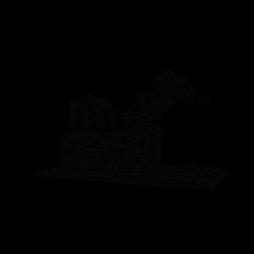 | 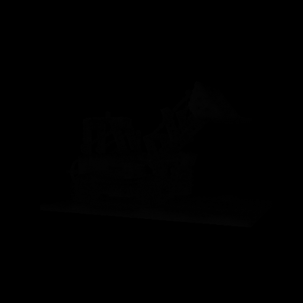 | 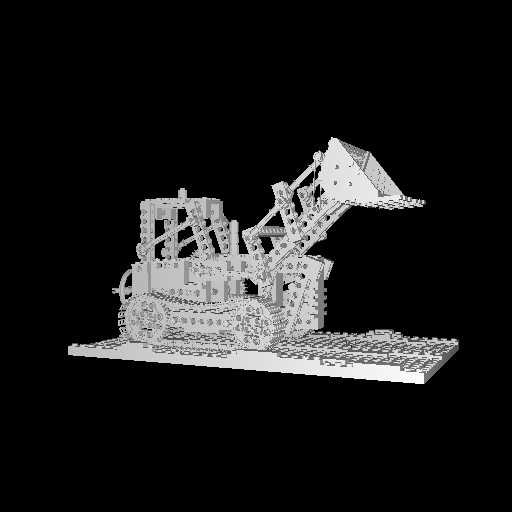 |

| Reference | Predicted (Total) |
|:-:|:-:|
| 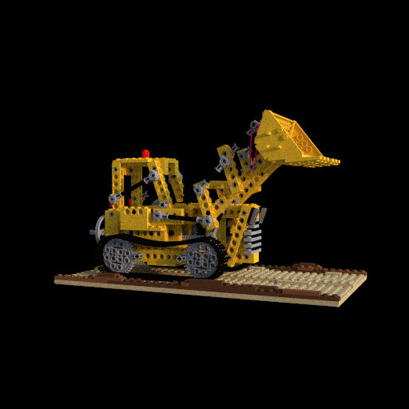 |  |

| Eye Cache | Light Cache |
|:-:|:-:|
|  | 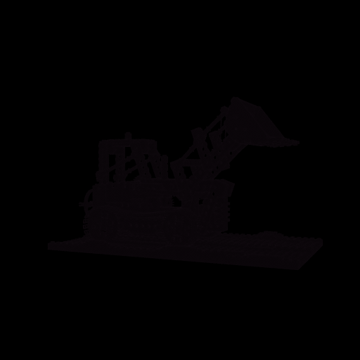 |

---

### Refractive Ball

| Mask (Light Frequency) | Light Density ($p_{l,\text{area}}$) | Eye Density ($p_{e,\text{area}}$) |
|:-:|:-:|:-:|
| 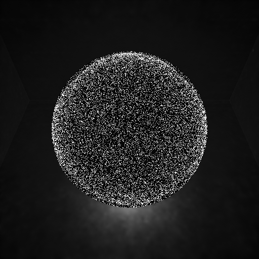 | 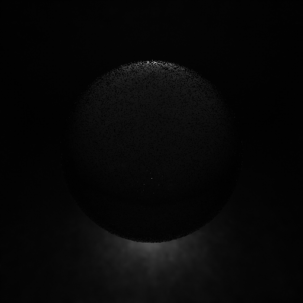 | 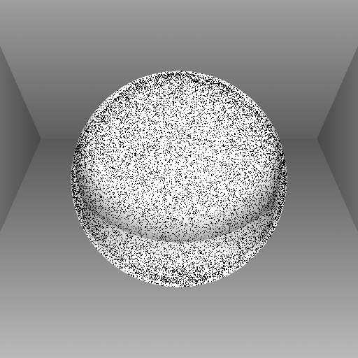 |

| Reference | Predicted (Total) |
|:-:|:-:|
| 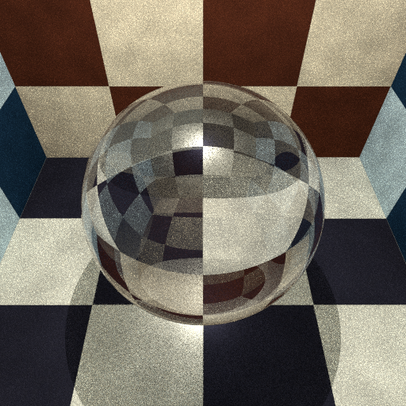 | 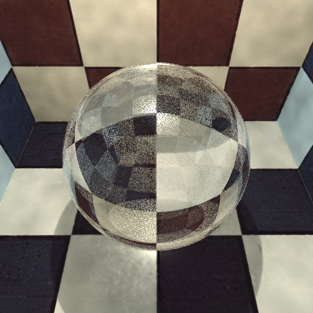 |

| Eye Cache | Light Cache |
|:-:|:-:|
| 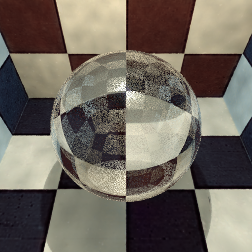 | 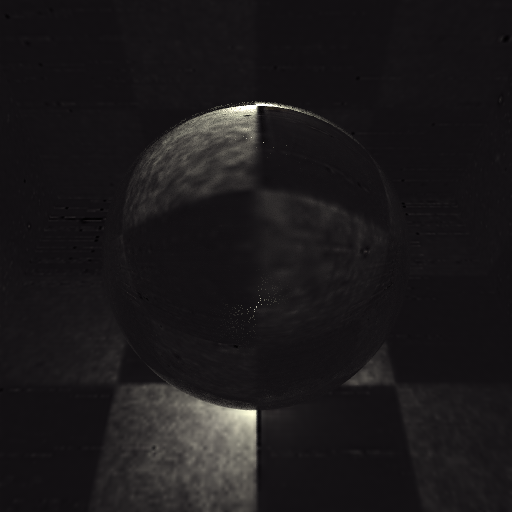 |

### Refractive Ball (Tinted Glass)

| Mask (Light Frequency) | Light Density ($p_{l,\text{area}}$) | Eye Density ($p_{e,\text{area}}$) |
|:-:|:-:|:-:|
| 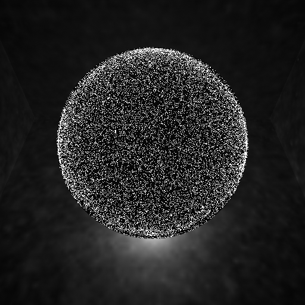 | 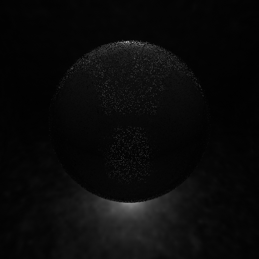 | 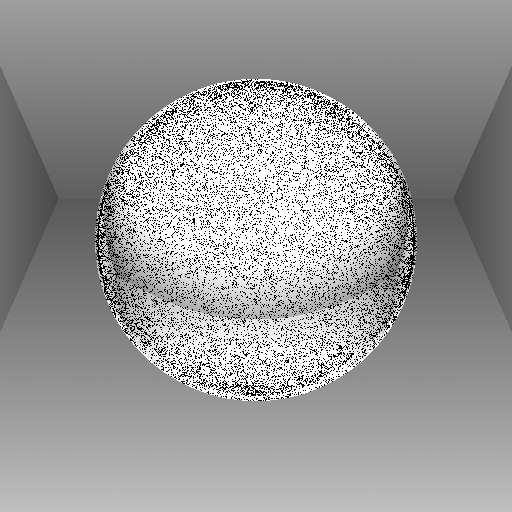 |

| Reference | Predicted (Total) |
|:-:|:-:|
| 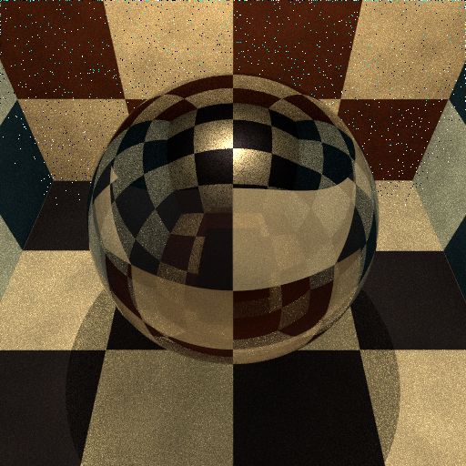 | 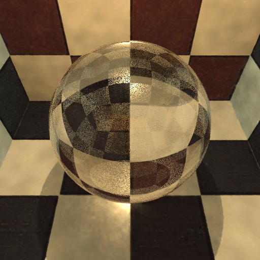 |

| Eye Cache | Light Cache |
|:-:|:-:|
| 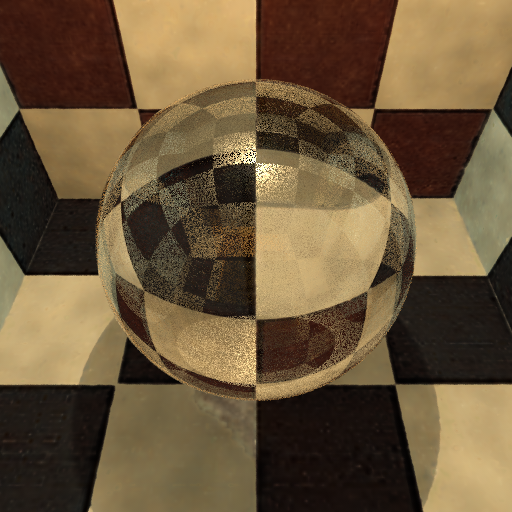 | 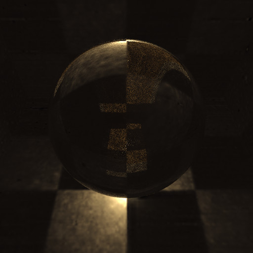 |

---

### Caustic Glass

| Mask (Light Frequency) | Light Density ($p_{l,\text{area}}$) | Eye Density ($p_{e,\text{area}}$) |
|:-:|:-:|:-:|
| 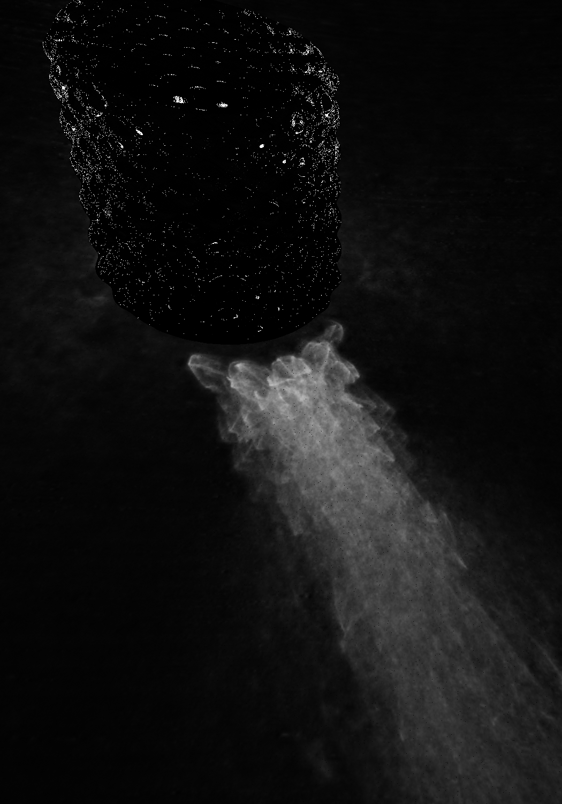 | 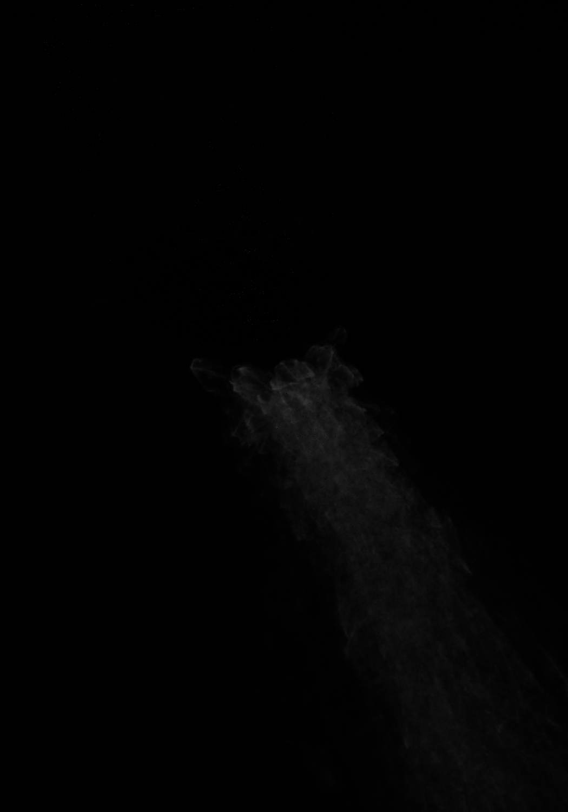 | 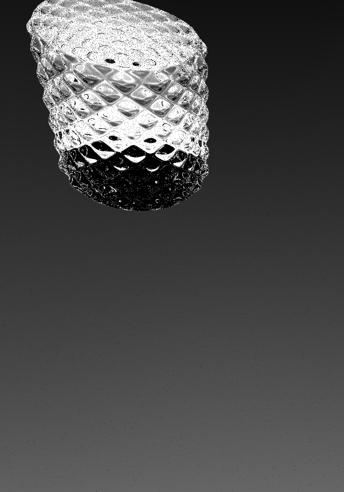 |

| Reference | Predicted (Total) |
|:-:|:-:|
| 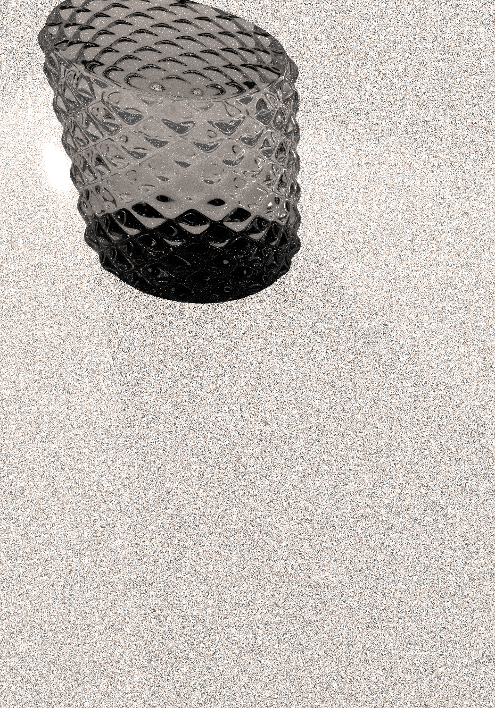 | 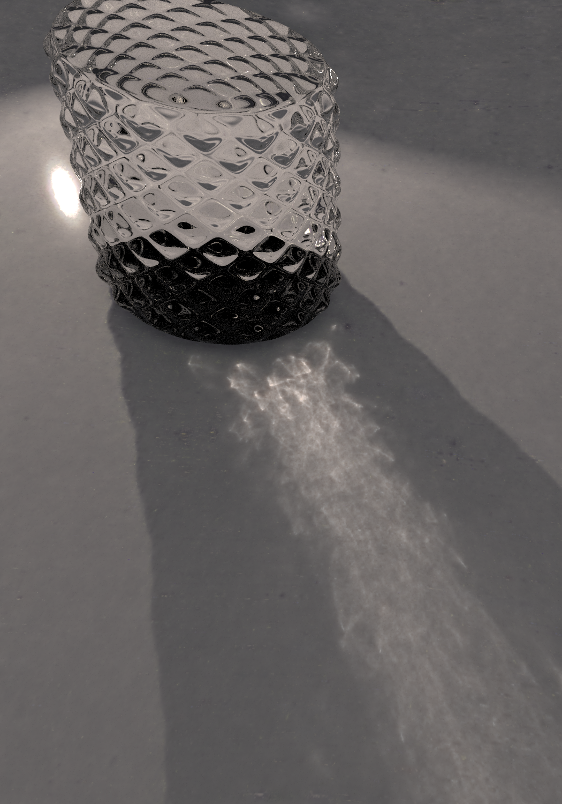 |

| Eye Cache | Light Cache |
|:-:|:-:|
| 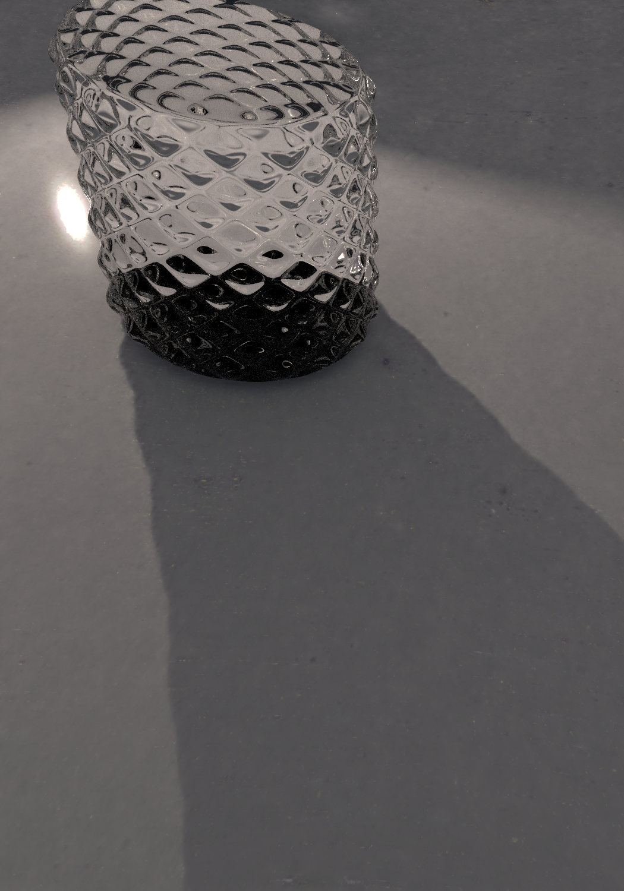 | 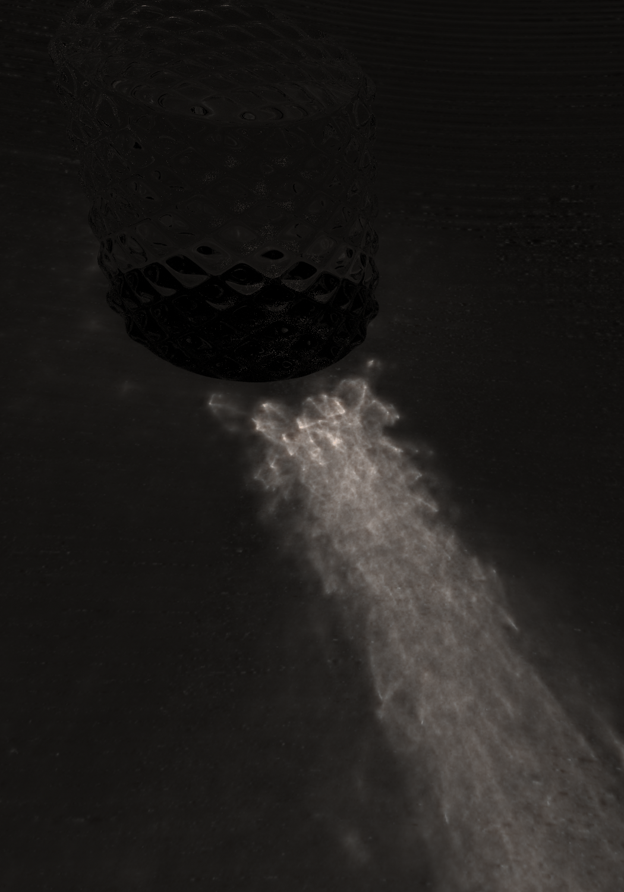 |
